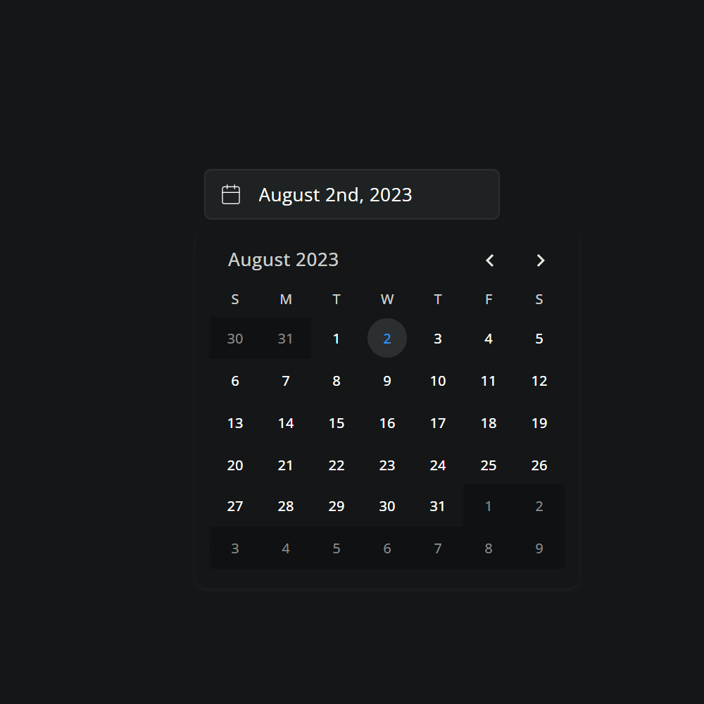
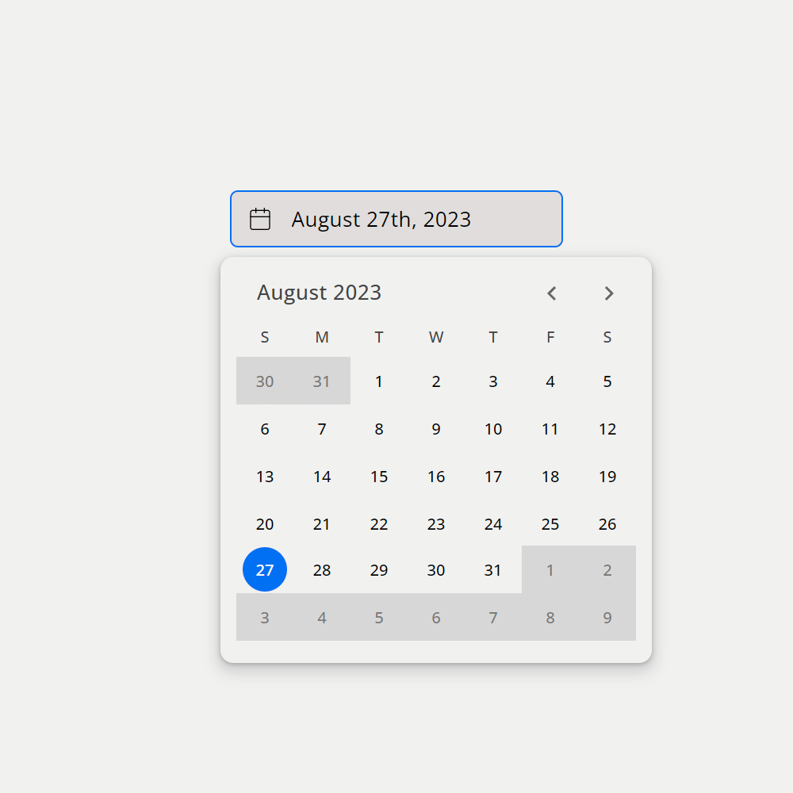

## monthpicker-lite-js

Lightweight month interface datepicker for Vanilla JS & Typescript

---

### Installation

```bash
npm i monthpicker-lite-js
```

[- View on NPM](https://www.npmjs.com/package/monthpicker-lite-js)

---

### Usage: Module

**Interfaces available for Typescript users.**

- The following example uses Vite.
- Some build tools require different css import schema.

```ts
import 'monthpicker-lite-js/dist/monthpicker-lite-js.css';

// vanilla js...
import { MonthPicker } from 'monthpicker-lite-js';

// typescript...
import { MonthPicker, MonthPickerInterface } ... 
```

---


*Dark mode*


*Light mode*
