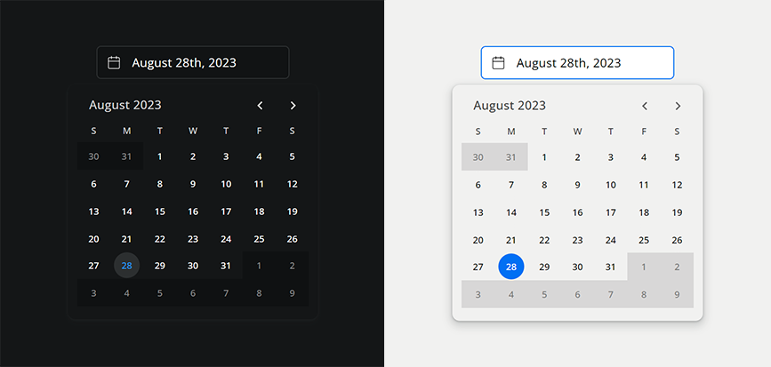

# monthpicker-lite-js

Zero-dependency, lightweight datepicker for Vanilla JS & Typescript.

## <a href="https://stackblitz.com/edit/monthpicker-lite-js" target="_blank">Typescript Stackblitz Demo V. 1.0.9 ></a>



## Sections
- [Installation](#installation)
- [Clone & Build](#clone/build)
- [Import](#import)
- [Features](#features)
- [Configuration](#configuration)
- [Methods](#methods)
- [Example](#example)
- [Accessibility](#accessibility)
- [License](#license)

## Installation

**Install via [NPM](https://www.npmjs.com/package/monthpicker-lite-js)**

```bash
npm i monthpicker-lite-js
```

## Clone/Build

Very minimal build process that uses Typescript and tsup.
~ Generates a minified build in the dist folder.

```bash
git clone https://github.com/chaseottofy/monthpicker-lite-js.git
npm install
cd monthpicker-lite-js-main
npm run build
```

## Import

**Interfaces available for Typescript users.**

- The following example uses Vite.
- Some build tools require different css import schema.

```ts
import 'monthpicker-lite-js/dist/monthpicker-lite-js.css';

// vanilla js...
import { MonthPicker } from 'monthpicker-lite-js';

// typescript...
import { MonthPicker, MonthPickerInterface } ... 
```

---

## Features

#### CSS & JS gzip: ~ 5-6kb

#### Zero Dependencies
- No external date handling libraries.
- No external styling libraries.
- Vanilla CSS & JS.

#### Relies solely on native Date object and DOM API
- Avoids common innerHTML pitfalls that can lead to XSS vulnerabilities.
- No need to worry about sanitizing user input.
- Does not rely on input type="date" for functionality.

#### Accessible - [Accessibility Section](#accessibility)
- Passes several audits 100% including lighthouse, NU HTML, and WCAG 2.1 contrast ratio requirements.
- Proper ARIA roles and attributes are applied to all relevant elements.
- Logical tab order and keyboard support. (all clickable elements are tabbable)

#### Customizable
- Vanilla CSS allows for easy customization without the need for any SAAS/LESS/SCSS compilers.
- Easily change theme from light to dark or edit existing CSS variables.
- Customizable date format and ability to show/hide days from previous and next months.
- Customizable callbacks that fire after a date is selected.

#### Responsive
- The monthpicker will position itself in the most optimal location relative to the input element so that it is always visible.
- Accounts for scrolling, window resizing, and input focus events.
- Adjusts itself on window resize.

#### Compatible
- Supports Typescript and ES6+.
- Compatible with all modern browsers and IE11.
- Avoids date parsing that breaks on some mobile browsers.
- Extends HTML5 input type=text rather than input type=date to avoid browser inconsistencies - notably CSS styling and mobile date parsing.

---

## Configuration

The monthpicker constructor consists of 8 total paramters, 7 of which are optional.
The simplest configuration is to pass only the rootContainer parameter.
`const monthpicker = new MonthPicker(rootContainer)`

Each of the below parameters, **except rootContainer** have a corresponding setter/getter method that can be called after instantiation.

- [Root parameter](#params-root) -- REQUIRED --
- [Date parameter](#params-date)
- [Format parameter](#params-format)
- [Theme parameter](#params-theme)
- [Callbacks parameter](#params-callbacks)
- [CloseOnSelect parameter](#params-closeOnSelect)
- [OnlyShowCurrentMonth parameter](#params-onlyShowCurrentMonth)
- [AlignPickerMiddle parameter](#params-alignPickerMiddle)

<a href="https://github.com/chaseottofy/monthpicker-lite-js/blob/main/src/monthpicker/monthpickerClass.ts">
  Link: MonthPicker Class Source Code
</a>

```ts
/**
 * MonthPicker
 * @constructor
 * @param rootContainer         HTMLElement  : Must be in DOM
 * @param date                  Date         : Start date (default: new Date())
 * @param format                input-format : mm/dd/yyyy ect.
 * @param THEME                 string       : light or dark
 * @param callbacks             Function[]   : <Array>[callbacks]
 * @param closeOnSelect         boolean      : Close picker on date 
 * @param onlyShowCurrentMonth  boolean      : Only show current month
 * @param alignPickerMiddle     boolean      : Align Picker to middle of Input
 */

const monthpicker = new MonthPicker(
  rootContainer: HTMLElement,       // REQUIRED 
  date?: Date,                      // OPTIONAL - default: new Date()
  format?: string,                  // OPTIONAL - default: 'Month dd, yyyy'
  THEME?: string,                   // OPTIONAL - default: 'dark'
  callbacks?: Function[],           // OPTIONAL - default: []
  closeOnSelect?: boolean,          // OPTIONAL - default: true
  onlyShowCurrentMonth?: boolean    // OPTIONAL - default: false
  alignPickerMiddle?: boolean       // OPTIONAL - default: false
)
```

### params-rootContainer

#### -- REQUIRED --

**rootContainer: HTMLElement**
- The element that the date input and monthpicker will be appended to.
- Once a variable is declared using the MonthPicker class, the rootContainer passed here will immediately be populated with both the input & monthpicker instance. (monthpicker is hidden by default)
- This is the only parameter that does not have a setter method. If you need to change the rootContainer, you will need to destroy the monthpicker and instantiate a new one with the new rootContainer.
- This can be done by calling the destroy() method on the monthpicker instance and then simply declaring a new variable with the MonthPicker class.

```html
<div class="container">
  <div class="month-picker-input-wrapper"><input /></div>
  <div class="month-picker">...</div>
</div>
```

- Note that the monthpicker is positioned absolutely and will ignore the layout of the rootContainer. 
- The position of the monthpicker is calculated based on the position of the input element. Several heuristics are used to ensure that the monthpicker is always visible - even if it has to overlap the input element or be positioned outside of the rootContainer. 
**For a more in depth explanation of the positioning logic, see [Link to Positioning Logic](https://github.com/chaseottofy/monthpicker-lite-js/blob/main/src/helpers/domHelpers.ts#L115-L221)**

- One more important note: 
  - Event Listeners are attached to the window object to allow for flexibility in terms of toggling and focus related actions. 
    - There are four listeners in total, all of which are removed when the monthpicker is destroyed.
    - Scrolling and Month navigation events are throttled @ 150ms
    - Resize events are debounced @ 50ms and have passive arguments set to true to prevent jank.

---

### params-Date

#### -- optional --

**date?: Date**
- Must be valid Date represented as a javascript Date object.
- Represents the date that the monthpicker will instantiate with.
- If no date is passed, the monthpicker will instantiate with the current date.

**Methods: @param date**
```ts
monthpicker.setDate(date: Date): void
monthpicker.getDate(): Date
monthpicker.getDateArray(): [
  number (year), 
  number (month), 
  number (day)
];

// get date as string of input format
// defaults to 'month dd, yyyy'
monthpicker.getDateFormatted(): string 
```

---

### params-format

#### -- optional --

**format?: string**
- Defaults to 'month dd, yyyy'
- Sets the format of the date input and can be accessed via the getDateFormatted() method.
- Accepts the following formats:
  - 'ddmmyyyy' (01092023)
  - 'dd/mm/yyyy' (09/01/2023)
  - 'mm/dd/yyyy' (01/09/2023)
  - 'dd-mm-yyyy' (09-01-2023)
  - 'mm-dd-yyyy' (01-09-2023)
  - 'month dd, yyyy' (January 9th, 2023)
  - 'month dd yyyy' (January 9 2023)
  - 'mth dd yyyy' (Jan 9 2023)
  - 'mth dd, yyyy' (Jan 9th, 2023)

**Methods: @param format**
```ts
monthpicker.setFormat(format: string): void
monthpicker.getFormat(): string
```

---

### params-theme

#### -- optional --

**theme?: string**
- Sets the theme of the input and monthpicker.
- Defaults to 'dark' : accepts ('light' | 'dark')

**Methods: @param theme**
```ts
monthpicker.setTheme(theme: string): void
monthpicker.getTheme(): string
```

---

### params-callbacks

#### -- optional --

**callbacks?: Function[]**
- Defaults to an empty array.
- Provides a way to pass custom functions to the monthpicker that instantiate after a date is selected.
- Each callback passed in the array will have access the same parameter 'date: Date' which represents the date that was selected.
- Callbacks are called in the order that they are passed.
  
**Methods: @param callbacks**

```ts
monthpicker.setCallbacks(callbacks: Function[]): void
monthpicker.getCallbacks(): Function[]

// Example
const callback = (date: Date) => console.log(date);
monthpicker.setCallbacks([callback]);
monthpicker.getCallbacks(); // [callback]
monthpicker.setCallbacks([])
monthpicker.getCallbacks(); // []
```

---

### params-closeOnSelect

#### -- optional --

**closeOnSelect?: boolean**
- Defaults to true.
- Close the monthpicker after a date is selected.

**Methods: @param closeOnSelect**
```ts
monthpicker.setCloseOnSelect(closeOnSelect: boolean): void
monthpicker.getCloseOnSelect(): boolean
```

---

### params-onlyShowCurrentMonth

#### -- optional --

**onlyShowCurrentMonth?: boolean**
- Defaults to false.
- Rather than showing days from previous and next months for the current month, only show the days within the current month.
- (Does not affect the layout of the monthpicker, Previous/Next days of month will just be blank).

**Methods: @param onlyShowCurrentMonth**
```ts
monthpicker.setOnlyShowCurrentMonth(onlyShowCurrentMonth: boolean): void
monthpicker.getOnlyShowCurrentMonth(): boolean
```

---

### params-alignPickerMiddle

#### -- optional --

**alignPickerMiddle?: boolean**
- Defaults to false.
- Align picker to middle of input element when possible

**Methods: @param alignPickerMiddle**
```ts
monthpicker.setAlignPickerMiddle(alignPickerMiddle: boolean): void
monthpicker.getAlignPickerMiddle(): boolean
```

---

## Methods

#### Full list of public methods
```ts
setRootContainer(rootContainer: HTMLElement): void;
setDate(date: Date): void;
setFormat(format: string): void;
setCallbacks(callbacks: DatepickerCallback): void;
setTheme(theme: string): void;
setCloseOnSelect(closeOnSelect: boolean): void;
setOnlyShowCurrentMonth(onlyShowCurrentMonth: boolean): void;
setAlignPickerMiddle(alignPickerMiddle: boolean): void;

getRootContainer(): HTMLElement | null;
getDate(): Date;
getDateArray(): number[];
getDateFormatted(): string;
getTheme(): string;
getCallbacks(): DatepickerCallback;
getFormat(): string;
getCloseOnSelect(): boolean;
getOnlyShowCurrentMonth(): boolean;
getAlignPickerMiddle(): boolean;

destroy(): void;
disable(): void;
enable(): void;
toggle(): void;
close(): void;
open(): void;

init(): void;
```

`monthPicker` will be used as the variable name for the rest of the examples.

#### Setters
```ts
/**
 * @method setRootContainer(HTMLElement) - set root container
 * @param HTMLElement - Must a valid HTMLElement in the DOM
 */
setRootContainer(rootContainer: HTMLElement): void;

/**
 * @method setDate(Date) - Sets date of monthpicker
 * @param date - Date Object (new Date())
 * Invalid dates will be ignored 
 * and will not update the monthpicker
 */
setDate(date: Date): void;

/**
 * @method setFormat(string) - Schema for input display
 * @param string - Must be one of the following formats:
 * Long (January) : 'month dd, yyyy', 'month dd yyyy',
 * Abbr (Jan)     : 'mth dd yyyy', 'mth dd, yyyy'
 * No Format      : 'ddmmyyyy'
 * Numeric Slash  : 'dd/mm/yyyy', 'mm/dd/yyyy'
 * Numeric Dash   : 'dd-mm-yyyy', 'mm-dd-yyyy'
 */
setFormat(format: string): void;

/**
 * @method setCallbacks(Function[]) - <Array>[callbacks]
 * @param callbacks - Array of functions
 * Each callback will have access to the 
 * same parameter 'date: Date' (Date Object of selected date)
 * Each callback will be instantiated in the order that they are passed
 * upon date selection.
 * @example
  const callback = (date: Date) => console.log(date);
  const callback2 = () => console.log('callback2');
  monthpicker.setCallbacks([callback, callback2]);
  returns: "date object, 'callback2'"
 */
setCallbacks(callbacks: DatepickerCallback): void;

/**
 * @method setTheme(string) - 'light' | 'dark'
 * Defaults to 'dark'
 */
setTheme(theme: string): void;

/**
 * @method setCloseOnSelect(boolean) - Close picker after date selection
 * Defaults to true.
 */
setCloseOnSelect(closeOnSelect: boolean): void;

/**
 * @method setOnlyShowCurrentMonth(boolean)
 * Defaults to false.
 * The monthpicker retains a fixed layout of 6 rows of 7 days.
 * By default, the monthpicker will show days from the previous and next months
 * To leave previous and next days blank, setOnlyShowCurrentMonth(true)
 */
setOnlyShowCurrentMonth(onlyShowCurrentMonth: boolean): void;

/**
 * @method setAlignPickerMiddle(boolean)
 * Align picker to middle of input element when possible
 * Defaults to false. (aligns to left of input)
 */
setAlignPickerMiddle(alignPickerMiddle: boolean): void;
```

#### Getters
```ts
// returns rootContainer
getRootContainer(): HTMLElement;

/**
 * Three options for getting the current date of the monthpicker
 * @method getDate() - Returns Date Object
 * @method getDateArray() - Returns [year, month, day] <Array of numbers>
 * @method getDateFormatted() - Returns date as string in specified format
 */
getDate(): Date;
getDateArray(): number[];
getDateFormatted(): string;

// returns array of set callbacks
getCallbacks(): DatepickerCallback; 

// returns current theme
getTheme(): string;

// returns set input format (mm/dd/yyyy ect.)
getFormat(): string; 

/**
 * The following three methods return booleans
 * @method getCloseOnSelect()
 * @method getOnlyShowCurrentMonth()
 * @method getAlignPickerMiddle()
 */
getCloseOnSelect(): boolean;
getOnlyShowCurrentMonth(): boolean;
getAlignPickerMiddle(): boolean;
```

#### Modifiers (destroy, open, ect.)
```ts
/**
 * @method destroy - Removes all monthpicker/input event listeners and clears DOM.
 * Any method called after destroy(), other than init(),
 * will be ignored and have no effect.
 */
destroy(): void;

/**
 * @method init() - Re-instantiates monthpicker and appends to DOM.
 * Called automatically after declaration of monthpicker instance.
 * Only method that can be called after @method destroy()
 * 
 * Will ignore subsequent calls if already instantiated.
 * 
 * init() & destroy() can work in tandem to keep the DOM clean if needed.
 * This is useful if your app is heavy with DOM content, however,
 * it is not recommended to destroy and re-instantiate since the logic
 * is configured to update rather than destruct and re-create.
 * 
 * Elements are only ever appended to the DOM once, if performance is a
 * concern, but you still want to have the ability to disable/enable, use
 * the disable() and enable() methods.
 */
init(): void;

/**
 * @method disable() - Disables monthpicker/input without clearing DOM.
 * @method enable()  - Enables monthpicker/input. (Default)
 * @method toggle()  - Toggles open/close
 * @method close()   - Force close
 * @method open()    - Force open
 */
disable(): void;
enable(): void;
toggle(): void;
close(): void;
open(): void;
```

---

## Example

**The monthpicker instance is created by declaring a variable with the MonthPicker class. There is no need to call any init method after declaration, however that option does exist if at any point `monthPicker.destroy()` is called.**

```ts
import 'monthpicker-lite-js/dist/monthpicker-lite-js.css';
import { 
  MonthPicker, 
  MonthPickerInterface,
  MonthPickerOptionsInterface
} from 'monthpicker-lite-js';
// MonthPickerOptionsInterface && 
// MonthPickerInterface are optional Typescript Interfaces

const container = document.querySelector('.container') as HTMLElement;
const callback3 = (date: Date) => console.log(date);
const options: MonthPickerOptionsInterface = {
  rootContainer: container,
  startDate: new Date(),
  pickerCallbacks: [
    ((date: Date) => console.log(date)),
    (() => console.log('callback2')),
    callback3,
  ],
  theme: 'dark',
  format: 'month dd, yyyy',
  closeOnSelect: true,
  onlyShowCurrentMonth: false,
  alignPickerMiddle: false,
}

// Declare with all options
const monthPicker = new MonthPicker(
  ...Object.values(options)
) as MonthPickerInterface;

// Declare with only rootContainer and no Interface
// const monthPicker = new MonthPicker(container);

// Date Methods
monthPicker.setDate(new Date(2020, 1, 1));
const currentDate = monthPicker.getDate();
const [year, month, day] = monthPicker.getDateArray();
const dateFormatted = monthPicker.getDateFormatted();

// Format Methods
monthPicker.setFormat('mm/dd/yyyy');
const currentFormat = monthPicker.getFormat();

// Theme Methods
monthPicker.setTheme('light');
const currentTheme = monthPicker.getTheme();

// Callback Methods
monthPicker.setCallbacks([cb]);
const currentCallbacks = monthPicker.getCallbacks();

// CloseOnSelect Methods
monthPicker.setCloseOnSelect(false);
const currentCloseOnSelect = monthPicker.getCloseOnSelect();

// OnlyShowCurrentMonth Methods
monthPicker.setOnlyShowCurrentMonth(true);
const currentOnlyShowCurrentMonth = monthPicker.getOnlyShowCurrentMonth();

// AlignPickerMiddle Methods
monthPicker.setAlignPickerMiddle(true);
const currentAlignPickerMiddle = monthPicker.getAlignPickerMiddle();

// Remove all event listeners and clear DOM
monthPicker.destroy();
monthPicker.setTheme('light'); // ignored

// Re-instantiate monthpicker
monthPicker.init();

// Change rootContainer of monthpicker
monthPicker.setRootContainer(document.querySelector('.new-container'));

// Disable monthpicker
monthPicker.disable();
monthPicker.setTheme('light'); // ignored

// Enable monthpicker
// Still will be dark theme as setTheme() above was ignored
monthPicker.enable(); 

// Force Open
monthPicker.open();

// Force Close
monthPicker.close();

// Toggle Open/Close
monthPicker.toggle();

monthPicker.init() // ignored as already instantiated
```

--- 

## Accessibility

**Keyboard Support**
- Tab: Moves focus to the next focusable element. All clickable elements on the monthpicker are capable of being tabbed to.
- Escape: Closes the monthpicker.
- *Hidden elements are not focusable.*

**ARIA Support**
- Proper ARIA roles and attributes are applied to all relevant elements.
- Tested with Lighthouse and NU HTML Checker to be 100% compliant.

**Contrast**
- Both themes pass WCAG 2.1 AAA contrast ratio requirements.
- Tested with Lighthouse to be 100% compliant.

---

#### Browser Support

Compatible with all modern browsers and IE11.
All date handling is done with the native Date object and should be compatible for the foreseeable future.

---

#### Passes the following audits:
- lighthouse performance/a11y/seo/best practices (100%)
- NU HTML Checker (100%)
- PageSpeed Insights audit (100%)
- WCAG 2.1 AA/AAA contrast ratio requirements (100%)

---

## License MIT

Copyright (c) 2023 Chase Ottofy

Permission is hereby granted, free of charge, to any person obtaining a copy
of this software and associated documentation files (the "Software"), to deal
in the Software without restriction, including without limitation the rights
to use, copy, modify, merge, publish, distribute, sublicense, and/or sell
copies of the Software, and to permit persons to whom the Software is
furnished to do so, subject to the following conditions:

The above copyright notice and this permission notice shall be included in all
copies or substantial portions of the Software.

THE SOFTWARE IS PROVIDED "AS IS", WITHOUT WARRANTY OF ANY KIND, EXPRESS OR
IMPLIED, INCLUDING BUT NOT LIMITED TO THE WARRANTIES OF MERCHANTABILITY,
FITNESS FOR A PARTICULAR PURPOSE AND NONINFRINGEMENT. IN NO EVENT SHALL THE
AUTHORS OR COPYRIGHT HOLDERS BE LIABLE FOR ANY CLAIM, DAMAGES OR OTHER
LIABILITY, WHETHER IN AN ACTION OF CONTRACT, TORT OR OTHERWISE, ARISING FROM,
OUT OF OR IN CONNECTION WITH THE SOFTWARE OR THE USE OR OTHER DEALINGS IN THE
SOFTWARE.